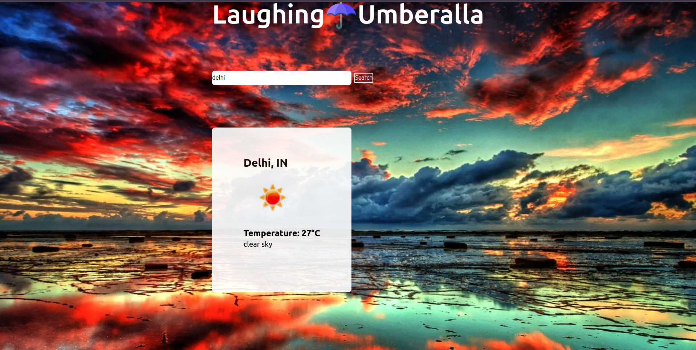

# ☂️ Laughing Umbrella(MERN Stack)

## 🌦️ Overview

This is a **MERN stack** (MongoDB, Express, React, Node.js) weather application that fetches real-time weather data using the **OpenWeatherMap API**. Users can search for a city, view weather details, and store the data in a local database.

## 🚀 Features

- Search weather by city or coordinates (latitude & longitude)
- Fetches real-time weather data from OpenWeatherMap API
- Displays temperature, weather conditions, and an icon
- Saves weather data to a MongoDB database
- Uses **Glassmorphism UI design** for a modern look
- Built with **React, Tailwind CSS, Express, Node.js, and MongoDB**

## 🛠️ Tech Stack

- **Frontend:** React, Vite, Tailwind CSS
- **Backend:** Node.js, Express.js
- **Database:** MongoDB (via Mongoose)
- **API:** OpenWeatherMap API
- **HTTP Client:** Axios

## 🔧 Installation

### 1️⃣ Clone the Repository

```bash
git clone https://github.com/Vigneshwaran-star/laughing-umbrella.git
cd laughing-umbrella
```

### 2️⃣ Install Dependencies

#### 📌 Frontend (React)

```bash
cd client
npm install
```

#### 📌 Backend (Node.js & Express)

```bash
cd server
npm install
```

### 3️⃣ Set Up Environment Variables

Create a **.env** file in the server directory and add the following:

```env
PORT=5000
MONGO_URI=your_mongodb_connection_string
```

### 4️⃣ Run the Application

#### Start Backend Server

```bash
cd server
npm start
```

#### Start Frontend

```bash
cd client
npm run dev
```

## 🌍 API Endpoints

### **🔹 Fetch Weather Data**

**GET** `/api/weather?lat={lat}&lon={lon}`☂️ 
Returns weather details for the given coordinates.

### **🔹 Save Weather Data**

**POST** `/api/weather`

```json
{
  "city": "Kolkata",
  "country": "IN",
  "temperature": 30,
  "description": "Clear sky",
  "icon": "01d"
}
```

## 🎨 UI Preview


## 🛠️ Future Enhancements

- Implement **search by city name** instead of coordinates
- Add **unit conversion** (Celsius ↔ Fahrenheit)
- Implement **user authentication** for personalized weather tracking
- Deploy the app using **Vercel (Frontend) & Render (Backend)**

## 🤝 Contributing

Feel free to fork this repository and submit a pull request with any improvements or bug fixes!

## 📜 License

This project is licensed under the **MIT License**.

